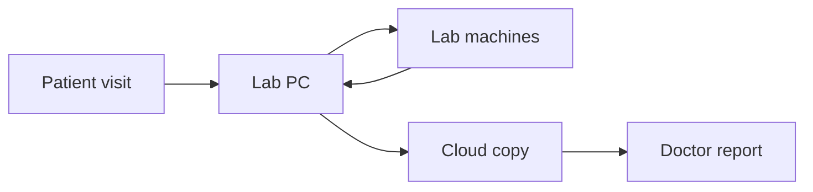
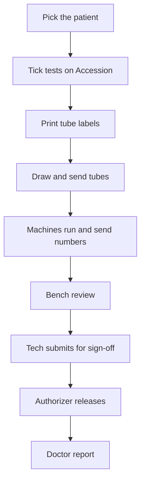

# How this lab system is built

This is the map of the whole product. It is written so a lab owner, a new staff member, or someone who does not write software can read it through and understand **what we built, why we built it that way, and how a real visit moves through the lab.**

First customer: **Drax Hall Clinical Laboratory**. The same design is meant to work for other labs later.

If a word is technical, we explain it the first time it appears. A longer word list lives in [GLOSSARY.md](./GLOSSARY.md). Deeper topics (identity, workflow, security runbooks) have their own pages; this file is the one story that connects them.

---

## What this software is

This is a **laboratory information system** — software that keeps track of:

- who the patient is
- what the doctor asked for
- which physical tubes were drawn
- what the machines (and the bench staff) measured
- who reviewed those numbers
- what is allowed to go to the doctor

The spine of the system is the **barcode on the tube**. Every label, every machine result, every “waiting to send” message, and every signed-off report hangs off that barcode. If the barcode is wrong, everything downstream is wrong. That is why so much of this design is about **the right person, the right visit, and the right tube**.

---

## The problem we designed for

A medical lab is not a website that can wait for the internet.

Four instruments sit on the floor at Drax Hall. They speak machine languages over cables or the local network. Staff print labels at the desk. Blood, urine, and other samples move from reception to those benches. Internet in a clinic drops. Power blips. The authorizer who signs results for the doctor may be in another room — or not in the building.

If the software lived only in the cloud:

- labels would not print when the line is down
- machines would have nowhere to send results
- the bench would freeze in the middle of a busy morning

If the software lived only on one lab computer:

- an authorizer could not sign off from elsewhere
- a dead hard drive could strand the official record
- reports and email would have no stable home

So we built **two layers that share one story**, on purpose.

1. A **lab PC** next to the instruments. It works with **no internet**.
2. A **cloud copy**. That is the official record for remote sign-off, reports, and the rest of the organization.

The lab PC is in charge of the floor. The cloud catches up. The doctor only sees work an authorizer has signed.

---

## Two computers on purpose

### The lab PC (we call this the “edge”)

This is a small computer in the lab. The app that runs on it is `edge-engine`.

**Why it exists:** the machines and the printer are in the building. Staff must accession, print labels, accept instrument numbers, and review the bench even if the clinic’s internet is dead.

**What it holds:** today’s patients, accessions, tube barcodes, raw machine messages, results, and a to-do list of things to tell the cloud (the **outbox** — explained later). That data lives in a single-file database on the disk (SQLite). There is no separate database server to babysit when the power comes back.

**What staff open:** on a production lab box, they open the lab PC itself — one address, one login, the screens for Accession, Labels, Bench, Patients, Staff, and Connection.

### The cloud

This is a hosted copy: a small server in front of a Postgres database (we use Supabase for the database and for cloud sign-in). The app in front of that database is `apps/api`. The same staff screens (`apps/web`) can be pointed at the cloud for **Release** and reports.

**Why it exists:** an authorizer should not have to sit at the mini PC. If that PC dies after work has already been sent up, signed-off results and reports should still exist. Emailing a patient report, saving lab-wide settings, and seeing the official queue all belong here.

**What it is not:** it is not the thing the machines talk to. Machines never call the internet. They talk only to the lab PC.

### Why the browser never writes straight into the cloud database

Staff screens are a website. If the browser wrote patient rows straight into the cloud database, we would lose the rules that live in the lab PC and the cloud API: unique accession numbers, identity confirmation, “this order is already linked,” audit, and “only released work goes to a report.”

So the path is always:

**staff screen → our server (lab PC or cloud API) → database**

The cloud database is the filing cabinet. Our server is the clerk who checks the paperwork.

---

## A visit, start to finish

This is the whole thinking, in the order it actually happens.

### 1. Pick the patient

Reception searches the local list by name or medical record number (MRN). If the person is not on file, they create a **provisional** local chart (a temporary MRN) and still accession. Specimens are never tied to a typed-in name with no chart.

If two charts look like the same person with different MRNs, the system **stops and asks**. Staff must say which chart this visit belongs to. Merging charts is a later admin job, not something Accession silently “fixes.” That gate exists so results do not land on the wrong person.

Deeper rules: [IDENTITY.md](./IDENTITY.md).

### 2. Tick the tests

The **Accession** screen *is* the doctor form. We do not scan paper with OCR today. Staff tick panels and individual tests the way the paper form is laid out. The catalog (the list of tests and panels) can come from the cloud when online; if the cloud is unreachable, the lab PC uses a bundled copy of the Drax Hall list so the counter does not stop.

### 3. Print labels — even if the internet is down

This is the most important operational rule:

**The lab PC creates the accession number and the tube barcodes first. Labels print immediately. Talking to the cloud is extra, not a gate.**

If the internet is down, staff still leave the desk with labeled tubes. The screen may say the order will sync when online. That is a warning, not a failure.

If the same patient had a very similar set of tests in the last couple of days, the lab PC **warns** (“a similar accession exists — continue only if this is a new visit”). Repeating Executive I next year is **not** a duplicate. Double-entering this morning’s form by accident **is**. Staff can continue; that choice is recorded.

### 4. Draw and route the tubes

Each physical tube gets **its own** specimen ID and barcode (for example `DH202609160001-01`, `-02`). Haematology and chemistry are often different tubes. The label shows the shared accession number (this visit) and the unique specimen ID (this tube). Machines scan the **specimen ID**.

### 5. Machines run

Someone scans the barcode at the instrument (or its connected PC). The machine measures, then sends numbers back to the lab PC, tagged with that same barcode. The lab PC stores the raw message, then turns it into result rows for Bench.

If the machine reports a test that was **not** on that tube’s order (a reflex run, a surprise code, or the wrong panel loaded on the analyzer), we **do not throw it away** and we **do not pretend it was ordered**. We keep the numbers, mark them clearly, and record that the surprise happened.

#### Where those “not ordered” results live (and who can see them)

There is **no separate archive folder or hidden vault**. Unexpected machine results sit in the **same clinical stores** as normal results, so staff can always find them if they need to investigate.

| What we keep | Where it lives | Who can use it |
| --- | --- | --- |
| **The full machine message** (exact bytes the instrument sent) | Lab PC database, in a **raw message** table | Support / engineering replay; proves what the machine actually said |
| **The parsed result row** (test name, value, units, flag, which tube, which analyzer) | Lab PC database, in the **result** table — **same table as ordered results** | **Bench** lists it like any other pending result |
| **An audit note** (`result.unexpected_on_order`) | Lab PC database, in the **audit** table (append-only) | Investigations: which accession, which machine code, when |
| **A cloud copy of the result row** | Postgres **`results`** table, after the outbox sends it | Authorizer **Release** queue and cloud-side review once synced |

So yes — **you have access**. Bench techs see unexpected results **on Bench**, in the same list as ordered work, with an amber **“Not ordered”** badge on that line. That badge is the filter in plain sight: it tells you “the doctor did not tick this on Accession,” not “this row was deleted.”

**What we do *not* do today:** hide unexpected results on a separate “archive” screen, or drop them from the lab PC because they were not on the form. Manual entry is stricter — if a tech tries to **type** a test that was not ordered, the lab PC **refuses**. Machine surprises are stored anyway because the instrument already ran; throwing them away would lose evidence.

**Doctor reports:** only **released** results may be exported or emailed. Unexpected machine rows are operational bench data until an authorizer signs them off with everything else. They are not silently mixed into a report as if they were ordered — the Bench badge and audit trail make the mismatch visible first. Deeper rules: [DATA_INTEGRITY.md](./DATA_INTEGRITY.md), [MACHINE_TO_REQUEST_FORM.md](./MACHINE_TO_REQUEST_FORM.md).

### 6. Bench review

Techs see results on **Bench** — including machine surprises flagged **Not ordered** (see above). They can enter manual tests (microscopy, ESR, and so on) that no machine will send; those must match what was ticked on Accession. They **cannot** release to the doctor. That is the authorizer’s job.

### 7. Submit for sign-off

When the order is ready, the tech clicks **Submit for release**. That is a local action. It works offline. The authorizer’s **Release** queue in the cloud will not show the work until the lab PC has sent it. Connection / **Send now** is how you check that copy. If the line is down, the UI says the authorizer will see it after connection.

### 8. Authorizer release

The authorizer reviews the queue (often from the cloud app) and signs off. Status becomes **released**. Only then may a patient report be exported or emailed.

A critical / STAT alert can hurry a human. It does **not** skip sign-off.

### 9. Doctor path

Reports, email, and any future doctor view consume **released** results only. Pending bench numbers are not a medical report.

Full role and status rules: [WORKFLOW.md](./WORKFLOW.md). Right patient / right tube / right result: [DATA_INTEGRITY.md](./DATA_INTEGRITY.md). Ordering and catalog: [REQUISITION.md](./REQUISITION.md).

---

## The three names on a tube

Staff use **three** identifiers. Mixing them up is how labs attach the right CBC to the wrong person.

| Name on the work | Question it answers | Example | On the label? |
| --- | --- | --- | --- |
| **MRN** | Who is this person? | A stable chart number | Yes, beside the name |
| **Accession number** | Which visit / doctor form is this? | `DH` + date + a daily sequence | Yes — shared by every tube on that form |
| **Specimen ID** (the barcode) | Which physical tube is this? | Accession + `-01`, `-02`, … | Yes — unique per tube; this is what machines scan |

There is **no fourth number** for staff to say aloud. A **requisition** is an internal cloud record of “what was ticked this visit.” It is a filing ID, not a label line.

A **session** on Labels or Orders is only a way the screens group rows. It is not stored as a unique ID and must not be used as proof of uniqueness.

**Repeats are normal.** Same panel next year → new accession, new specimen IDs. Old results stay on the old visit. History is for context, not a block.

**“Duplicate” means the same encounter entered twice**, not the same test ordered twice in a lifetime.

---

## Who does what

| Who | What they do | What they must not do |
| --- | --- | --- |
| **Reception / phlebotomy / bench tech** | Find or create patients, accession, print labels, run machines, review Bench, submit for sign-off | Release results to the doctor; sign into the cloud app |
| **Authorizer** (usually one or two people) | Sign off results, answer STAT alerts, send work back to the bench if needed | Skip review because an alert fired |
| **Admin** | Staff accounts, device enrollment for cloud access, lab routing settings | Treat settings save as a bench-critical path when offline |
| **Doctor / patient (later / reports)** | Receive signed-off reports | See pending bench numbers |

Techs work on the **lab PC**. They never need the cloud app, so they never get cloud login — even with the right password. Authorizers and admins may be out of the lab; that is why the cloud app exists, and why it is locked harder.

Job title (phlebotomist, lab technologist) is what someone **does**. Role (tech, authorizer, admin) is what they are **allowed** to do. Collectors on Accession are chosen by job title, not by permission role.

---

## How the four machines talk to us

Plain names first. Protocol names are in [ANALYZERS.md](./ANALYZERS.md) for people wiring cables.

| Machine | What it is, in English | How it usually reaches the lab PC |
| --- | --- | --- |
| **Sysmex XS-1000i** | Blood cell counter (CBC) | Serial cable or network |
| **Mindray BS-240** | Chemistry analyzer (glucose, kidney, lipids, …) | Serial cable or network |
| **Diamond ProLyte** | Electrolytes (sodium, potassium, chloride, lithium) | Local network post, or serial |
| **YHLO iFlash 1200** | Immunoassay (hormones, infectious serology, …) | Network |

**Why a local PC in the middle:** these machines were not built to call a website on the internet. They send short messages on the bench network or a serial cable. The lab PC listens, stores, and only later copies a clean version to the cloud.

**The join key is the barcode.** The label we printed is the ID the machine sends back. If that ID does not match a tube we registered, Bench may show no patient name until the accession exists.

**Not every catalog test comes from a machine.** Microscopy, ESR, blood bank, and similar work are **manual**. Staff type those on Bench. The catalog knows which codes are machine, manual, or send-out. Release can block if required manual pieces are still missing, unless a tech explicitly submits anyway.

**We remap machine codes to the request-form codes** so “what the doctor ticked” and “what Bench shows” are the same language. That mapping is documented in [MACHINE_TO_REQUEST_FORM.md](./MACHINE_TO_REQUEST_FORM.md).

For development we have **fake machines** (`apps/simulators`) so we can test the loop without the real analyzers.

---

## How work gets to the cloud (the outbox)

Think of a **mail tray on the lab PC**, not a live video call.

1. Something important happens locally (new patient, accession, machine result, submit for release, staff change).
2. It is **saved on the lab PC first**. We never drop a machine payload we already accepted.
3. A small message is put in the outbox, in order.
4. When the internet is up, the lab PC **pushes** those messages to the cloud. The cloud does not poll the lab.
5. The cloud writes its copy, then says “got it.” The outbox row is marked sent. **The local patient and result rows stay** on the lab PC. We only clear old mail-tray slips, not the clinical record.

If the send fails, the tray keeps the message and tries again. **Send now** on the Connection screen forces a send instead of waiting.

**Cloud sync is not a backup of the lab PC.** If the disk dies at 4 p.m., the cloud may have yesterday’s signed-off work and whatever was already sent today. It will not have every unsynced accession, every pending tray item, or every raw instrument frame. That is why the lab PC also needs **local backups** on a second disk. See [EDGE_SECURITY_AND_BACKUP.md](./EDGE_SECURITY_AND_BACKUP.md) and [SYNC.md](./SYNC.md).

**Who wins if copies disagree**

- The lab PC is the source of truth for what the machines and the bench typed **before** authorization.
- The cloud is the source of truth for **release** and for what may appear on a report.
- Once something is released, an older lab-PC message must not quietly rewrite it.

---

## Where the folders live

This repository is one project with several apps inside (a monorepo). You do not need the folder names to use the lab. You need them to see that the split above is real in the code.

| Place | In English | Why it is separate |
| --- | --- | --- |
| `apps/edge-engine` | The lab PC program | Must run next to machines, offline, with its own database file |
| `apps/api` | The cloud clerk in front of the filing cabinet | Validation, sync ingest, release, reports, notifications |
| `apps/web` | The screens staff use | Same product, pointed at the lab PC **or** the cloud |
| `apps/simulators` | Fake analyzers and a fake label printer | Safe testing without real hardware |
| `packages/catalog` | Drax Hall test list, panels, routing, “is this similar?” | Shared so the counter, labels, and machines agree |
| `packages/contracts` | Agreed shapes of messages | So the lab PC, cloud, and screens do not drift apart |
| `packages/protocols` | How to read machine dialects | Pure rules, tested without the whole lab stack |
| `supabase/` | Cloud database change files | How the official copy’s tables evolve |
| `infra/` | How we package the lab PC for Docker | One container in production; several in local simulation |
| `docs/` | This map and the specialist guides | Living product memory |

On a **production lab PC**, one container serves the lab program **and** the staff screens from the same place, so staff do not juggle two websites. On a **developer laptop**, we run lab PC + cloud + screens separately so we can simulate both sides.

Install and wiring of the real mini PC: [LAB_MINI_PC_SETUP.md](./LAB_MINI_PC_SETUP.md). How to run the fake lab on a laptop: [LOCAL_DEV.md](./LOCAL_DEV.md).

---

## Security — how it actually works

Patient names, dates of birth, accession numbers, and results are **protected health information**. Security is not a sticker we add at the end. It is why the two-computer split looks the way it does.

This section is meant to be in the GitHub copy of this project. It explains **what we do and why**. It does not include secrets, production addresses, or instructions that would help someone abuse the lab network.

### 1. The lab PC holds today’s work on disk

If someone walks out with the computer, or pulls the drive, they have a copy of the local database unless the **room is locked** and the **disk is encrypted**. Cloud sync does not erase that risk. Physical control and disk encryption are part of go-live, not optional decoration.

### 2. Staff log into the lab PC with no internet

The bench cannot wait for a cloud login page. Every staff account is **created on the lab PC**. The password is stored as a **slow one-way hash** (a scrambled form you cannot turn back into the password). Sign-in works when the clinic line is down.

In production hardening, patient and label routes require that login. Practice-only doors used in development (fake ingest, demo seed) are **off**.

### 3. The cloud app is locked twice

Remote sign-off is valuable. It is also the kind of access that gets abused if it is just “email and password from any cafe.”

So the cloud app:

- **Refuses techs entirely.** They have a cloud identity so their name is correct on old results and audit, but the login system will not issue them a session — even with the correct password. That check happens at the login door, not as an afterthought on one screen.
- **Requires a known computer** for admin and authorizer. An admin at the lab PC issues a short-lived, one-time code. The person types it on that browser once. The browser then remembers a secret of its own. Day to day is email + password; the extra proof is automatic. If the laptop is lost, that device can be revoked.

A website cannot read a computer’s hardware serial number. That is a browser privacy rule, not a gap we forgot. The enrollment secret is how we recognize “this is still the same lab computer” without that hardware ID.

Full story: [EDGE_AUTH_AND_STAFF.md](./EDGE_AUTH_AND_STAFF.md).

### 4. The lab PC proves it is the lab PC when it sends work up

Staff passwords are for people. The copy process uses a **machine secret** stored on the lab PC so a random computer on the internet cannot dump fake accessions into the official copy. Traffic to the cloud is encrypted (HTTPS).

### 5. We write history that does not get edited later

Identity confirmations, “continue anyway” on a similar accession, unexpected machine tests, submit, recall, release, staff login attempts, and device enroll/revoke are appended to an audit log. We store a snapshot of **who** (and on the cloud, **which device**) at that moment, so renaming a person later does not rewrite the past.

The audit table is not a scratch pad. Updates and deletes of those rows are forbidden in the cloud database rules.

More: [AUDIT.md](./AUDIT.md).

### 6. The doctor only sees signed-off work

Pending bench numbers, failed instrument retries, and **“Not ordered”** machine rows on Bench are operational — visible to staff, stored on the lab PC (and copied to the cloud when synced), but not a doctor report by themselves. Export and email read **released** results only.

### 7. The lab network is not the public internet

The staff screens on the lab PC are meant for the **staff network**, not guest Wi-Fi, and not a hole poked through the clinic firewall to the world. The cloud app is the thing that is allowed to exist on the wider internet — and it carries the extra locks above.

HTTPS for the lab PC **on the local network** (so a packet sniffer on the LAN cannot read a login ticket) is a go-live follow-up, not something we pretend is finished. Cloud calls already use encryption.

### 8. The software itself is checked before it is trusted

Clinical integrity (right patient, right tube) is useless if the code is quietly broken or a known-bad library is sitting in the install.

Before work is merged to the main branches we:

- install **exactly** the dependency list we already reviewed (no surprise packages)
- run lint, typecheck, and tests
- fail on high/critical known holes in those packages
- scan the lockfile against a public vulnerability database
- run static analysis on the JavaScript/TypeScript

Someone who finds a live patient-data or login flaw should **email privately**, not open a public GitHub issue.

Patch timing, waivers, and commands: [SECURITY.md](./SECURITY.md). Mini PC hardening and backup drills: [EDGE_SECURITY_AND_BACKUP.md](./EDGE_SECURITY_AND_BACKUP.md).

### What this file will not teach

We will not publish real tokens, staff passwords, production hostnames, or step-by-step “how to hit an unlocked door.” Those would help the wrong reader more than the right one. The *ideas* — locked PC, offline login, cloud refused to techs, enrolled devices, machine secret, append-only audit, released-only reports — belong here and belong on GitHub.

---

## What is already real, and what is still go-live work

This is not a sketch. Accession, labels, machine ingest, Bench, submit/release, reports, offline staff login, cloud device enrollment, and ordered sync already exist.

Still honest about hardware and operations:

- Encrypt the lab PC disk; lock the room; keep the staff network off guest Wi-Fi.
- Put local database backups on a **different disk** than the live file; test a restore; plan an off-site copy.
- Add HTTPS on the lab LAN when you expose the UI beyond “same machine.”
- A hired penetration test before you treat the system as battle-ready.
- Real analyzer soak time next to the live benches (shadow mode), not only simulators.

Build order and leftovers: [ROADMAP.md](./ROADMAP.md). Hands-on mini PC steps: [LAB_MINI_PC_SETUP.md](./LAB_MINI_PC_SETUP.md).

---

## Where to read more

| If you want… | Read |
| --- | --- |
| Word list | [GLOSSARY.md](./GLOSSARY.md) |
| Bench, submit, release, reports | [WORKFLOW.md](./WORKFLOW.md) |
| Right patient / right tube / offline accession | [DATA_INTEGRITY.md](./DATA_INTEGRITY.md) |
| Duplicate charts, provisional MRNs | [IDENTITY.md](./IDENTITY.md) |
| Doctor form, catalog, panels | [REQUISITION.md](./REQUISITION.md) |
| The four instruments in English | [ANALYZERS.md](./ANALYZERS.md) |
| Connection screen and copy rules | [SYNC.md](./SYNC.md) |
| Who can log in where | [EDGE_AUTH_AND_STAFF.md](./EDGE_AUTH_AND_STAFF.md) |
| Locks, backups, restore drill | [EDGE_SECURITY_AND_BACKUP.md](./EDGE_SECURITY_AND_BACKUP.md) |
| Reporting a hole; dependency checks | [SECURITY.md](./SECURITY.md) |
| Audit events | [AUDIT.md](./AUDIT.md) |
| Run it on a laptop | [LOCAL_DEV.md](./LOCAL_DEV.md) |
| Install the real lab PC | [LAB_MINI_PC_SETUP.md](./LAB_MINI_PC_SETUP.md) |
| What is built vs later | [ROADMAP.md](./ROADMAP.md) |
